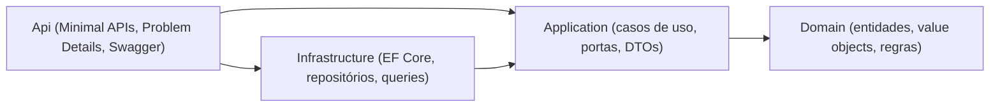

# OniBus Express

API de **venda de passagens rodoviárias** (backend). Permite listar rotas, buscar viagens,
consultar o mapa de assentos e **reservar/cancelar** assentos com garantia de que o mesmo assento
nunca é vendido duas vezes — inclusive sob requisições concorrentes.

O projeto foi construído com **Clean Architecture**, desenvolvimento guiado por testes e uma suíte
que vai de testes unitários de domínio a testes de ponta a ponta contra um PostgreSQL real.

---

## Sumário

- [Como executar](#como-executar)
- [Endpoints](#endpoints)
- [Tecnologias e justificativa](#tecnologias-e-justificativa)
- [Arquitetura e decisões](#arquitetura-e-decisões)
- [Concorrência: o coração do sistema](#concorrência-o-coração-do-sistema)
- [O que foi implementado (e o que ficou fora de escopo)](#o-que-foi-implementado-e-o-que-ficou-fora-de-escopo)
- [Testes e cobertura](#testes-e-cobertura)
- [Estrutura do projeto](#estrutura-do-projeto)
- [Melhorias futuras](#melhorias-futuras)
- [Documentação de referência](#documentação-de-referência)

---

## Como executar

### Pré-requisitos

- [.NET 8 SDK](https://dotnet.microsoft.com/download/dotnet/8.0)
- [Docker](https://www.docker.com/) (para o caminho com contêiner e para os testes de integração)

### Com Docker (recomendado)

```bash
docker compose up --build
```

Sobem dois serviços: **PostgreSQL 16** e a **API**. As *migrations* e o *seed* de dados são
aplicados automaticamente no startup, então a API já sobe pronta para uso.

- API: <http://localhost:8080>
- **Swagger UI**: <http://localhost:8080/swagger>
- Health: <http://localhost:8080/health> · Readiness: <http://localhost:8080/health/ready>

### Sem Docker

É necessário um PostgreSQL 16 acessível. A forma mais simples é subir **apenas o banco** via Compose
e rodar a API no host:

```bash
docker compose up -d postgres
dotnet run --project src/OniBusExpress.Api
```

A string de conexão padrão (`appsettings.json`) já aponta para `localhost:5432`. Para outro banco,
sobrescreva `ConnectionStrings:Default` (via `appsettings` ou variável de ambiente
`ConnectionStrings__Default`).

A API aplica as *migrations* e o *seed* no startup. Caso prefira aplicar o schema separadamente:

```bash
dotnet tool restore
dotnet ef database update --project src/OniBusExpress.Infrastructure --startup-project src/OniBusExpress.Infrastructure
```

---

## Endpoints

Prefixo base `/api`. Corpo em JSON, datas em ISO-8601 (UTC).

| Método | Rota | Descrição |
|---|---|---|
| `GET` | `/api/routes` | Lista rotas (filtro opcional `origin`, `destination`). |
| `GET` | `/api/trips` | Busca viagens por `origin`, `destination`, `date` (`YYYY-MM-DD`). |
| `GET` | `/api/trips/{id}` | Detalhe da viagem com o **mapa de assentos**. |
| `POST` | `/api/reservations` | Cria uma reserva. Retorna `201` + header `Location`. |
| `GET` | `/api/reservations/{code}` | Recupera a reserva pelo código (CPF mascarado). |
| `POST` | `/api/reservations/{code}/cancellation` | Cancela a reserva. |

Erros seguem **Problem Details (RFC 7807)**, com status apropriado por caso: `400` (validação),
`404` (inexistente), `409` (assento ocupado / reserva já cancelada), `422` (viagem no passado,
assento fora do intervalo, fora da janela de cancelamento).

Exemplo — criar reserva:

```bash
curl -X POST http://localhost:8080/api/reservations \
  -H "Content-Type: application/json" \
  -d '{ "tripId": "b0000000-0000-0000-0000-000000000001",
        "seatNumber": 12,
        "passenger": { "name": "Maria Silva", "cpf": "111.444.777-35" } }'
```

---

## Tecnologias e justificativa

| Tecnologia | Por quê |
|---|---|
| **.NET 8 (LTS)** | Versão de suporte estendido; base estável e de longa vida para a API. |
| **ASP.NET Core Minimal APIs** | Endpoints enxutos, baixo *overhead* e startup rápido para uma API focada. |
| **EF Core + Npgsql** | Mapeamento objeto-relacional maduro para PostgreSQL, com *migrations* versionadas. |
| **PostgreSQL 16** | Banco relacional robusto; o **índice único parcial** é a peça central da concorrência. |
| **FluentValidation** | Validação de entrada declarativa e testável, separada do domínio. |
| **Serilog** | Log estruturado com *id* de correlação por requisição. |
| **Swashbuckle (Swagger)** | Documentação executável dos endpoints (OpenAPI), operável pela UI. |
| **xUnit + Testcontainers** | Testes de integração contra um PostgreSQL **real**, não *in-memory*. |
| **coverlet + ReportGenerator** | Medição de cobertura de testes. |
| **NetArchTest** | Testes que garantem as fronteiras entre camadas. |

---

## Arquitetura e decisões

**Clean Architecture** em quatro camadas, com as dependências sempre apontando para dentro. O
**Domínio** é puro (sem dependência de framework, banco ou web).



Princípios **SOLID** na prática: cada caso de uso tem uma responsabilidade única; a Application
depende de **abstrações** (portas) implementadas pela Infrastructure (inversão de dependência); os
*value objects* são fechados para modificação e válidos por construção.

Padrões de projeto empregados:

- **Value Object** (`Cpf`, `ReservationCode`, `PassengerName`): imutáveis, com igualdade por valor e
  validados na construção — estados inválidos são irrepresentáveis.
- **Result** para erros de negócio previsíveis, evitando exceções para controle de fluxo; traduzido
  para **Problem Details** na borda HTTP.
- **Repositório específico + Query services (CQRS-lite)**: escrita via repositórios de agregado;
  leitura via *queries* otimizadas (`AsNoTracking`, projeções) — sem repositório genérico.
- **TimeProvider** (relógio injetável do .NET 8) para tornar as regras temporais testáveis.

As decisões estão registradas em [**ADRs**](docs/adr/):

| ADR | Decisão |
|---|---|
| [0001](docs/adr/0001-arquitetura-em-camadas.md) | Arquitetura em camadas (Clean Architecture) |
| [0002](docs/adr/0002-framework-net8.md) | Framework-alvo .NET 8 (LTS) |
| [0003](docs/adr/0003-postgresql.md) | PostgreSQL como banco relacional |
| [0004](docs/adr/0004-sem-repositorio-generico.md) | Sem repositório genérico |
| [0005](docs/adr/0005-result-e-problem-details.md) | Erros via Result + Problem Details |
| [0006](docs/adr/0006-cancelamento-via-post.md) | Cancelamento via `POST /cancellation` |
| [0007](docs/adr/0007-codigo-de-reserva.md) | Geração do código de reserva |
| [0008](docs/adr/0008-concorrencia-indice-unico-parcial.md) | Double-booking via índice único parcial |
| [0009](docs/adr/0009-minimal-apis-em-modulos.md) | Minimal APIs organizadas em módulos |

O **system design** completo, a estimativa de capacidade e o plano de escala/custo estão no
[`docs/plan.md`](docs/plan.md); o contrato detalhado, as regras de negócio e a matriz de testes no
[`docs/spec.md`](docs/spec.md).

---

## Concorrência: o coração do sistema

Dois clientes podem tentar reservar **o mesmo assento na mesma viagem** ao mesmo tempo. A garantia de
que apenas um vence **não** é feita por uma checagem "consulta-depois-insere" em código (que abre uma
janela de corrida), e sim por uma **restrição no banco** — um índice único **parcial**:

```sql
CREATE UNIQUE INDEX ux_reservation_active_seat
    ON reservation (trip_id, seat_number)
    WHERE status = 'Confirmed';
```

Apenas reservas **confirmadas** entram no índice, então cancelar um assento o **libera** para uma
nova reserva. Uma violação de unicidade (`23505`) é traduzida em `409 Conflict`. Esse comportamento é
verificado por um teste de integração que dispara **N requisições paralelas** no mesmo assento e
exige exatamente **1 sucesso e N-1 conflitos** (ver ADR-0008).

---

## O que foi implementado (e o que ficou fora de escopo)

**Escopo:** backend. A interface de usuário está fora de escopo.

**Implementado:**

- Os 6 requisitos funcionais (RF-01 a RF-06) e as 9 regras de negócio (RN-01 a RN-09).
- Prevenção de double-booking garantida no banco, validada sob concorrência real.
- Geração de código de reserva legível (`ABC-12345`), com regeneração em caso de colisão.
- **Privacidade (LGPD):** CPF validado por módulo 11, armazenado normalizado, **mascarado** nas
  respostas e mantido fora dos logs.
- Problem Details (RFC 7807), validação de entrada, health checks, log estruturado com correlação e
  documentação Swagger.
- Empacotamento com Docker (imagem multi-stage, usuário não-root) e execução com/sem contêiner.
- Suíte de testes: unitários, integração (Testcontainers), funcionais (ponta a ponta) e de
  arquitetura.

**Fora de escopo (decisão consciente):** interface de usuário; autenticação/autorização; pagamento;
verificação do CPF junto à Receita Federal; internacionalização. As premissas completas estão na
[`docs/spec.md`](docs/spec.md) (§2 e §12).

---

## Testes e cobertura

```bash
dotnet test
```

A pirâmide de testes:

- **Unitários** — domínio puro (CPF, código de reserva, janela de 2h, faixa de assentos, casos de uso).
- **Integração** — PostgreSQL real via **Testcontainers** (persistência, **concorrência**, consultas). Requer Docker.
- **Funcionais** — API de ponta a ponta com `WebApplicationFactory` + Testcontainers.
- **Arquitetura** — `NetArchTest` valida que o Domínio não depende de Infrastructure/Api.

Relatório de cobertura:

```bash
dotnet tool restore
dotnet test --collect:"XPlat Code Coverage" --settings coverlet.runsettings --results-directory ./coverage
dotnet tool run reportgenerator -reports:"coverage/**/coverage.cobertura.xml" -targetdir:coverage/report -reporttypes:Html
```

Cobertura de linha em torno de **89%**, com o **Domínio acima de 97%** — as regras de negócio
(RN-01 a RN-08) estão amplamente cobertas.

---

## Estrutura do projeto

```
src/
  OniBusExpress.Domain/          Entidades, value objects, regras — sem dependências externas
  OniBusExpress.Application/     Casos de uso, portas (interfaces), DTOs
  OniBusExpress.Infrastructure/  EF Core, DbContext, migrations, repositórios, queries, seed
  OniBusExpress.Api/             Minimal APIs, Problem Details, Swagger, DI, observabilidade
tests/
  OniBusExpress.UnitTests/
  OniBusExpress.IntegrationTests/
  OniBusExpress.FunctionalTests/
  OniBusExpress.ArchitectureTests/
docs/                            spec, plan, constitution, ADRs
```

---

## Melhorias futuras

- Autenticação/autorização e limitação de taxa (*rate limiting*).
- Paginação e filtros adicionais nas listagens.
- Telemetria (métricas e *tracing* via OpenTelemetry).
- Pipeline de CI (build + testes + cobertura a cada push).

---

## Documentação de referência

- [`docs/spec.md`](docs/spec.md) — contrato, regras de negócio, modelo de dados, matriz de testes.
- [`docs/plan.md`](docs/plan.md) — stack, system design, capacidade, escala e custo.
- [`docs/constitution.md`](docs/constitution.md) — princípios que guiam o projeto.
- [`docs/adr/`](docs/adr/) — registros de decisão de arquitetura.
