# OniBus Express

[](https://github.com/medinasp/OniBus-Express/actions/workflows/ci.yml)

API de **venda de passagens rodoviárias** (backend). Permite listar rotas, buscar viagens,
consultar o mapa de assentos e **reservar/cancelar** assentos com garantia de que o mesmo assento
nunca é vendido duas vezes — inclusive sob requisições concorrentes.

O projeto foi construído com **Clean Architecture**, desenvolvimento guiado por testes e uma suíte
que vai de testes unitários de domínio a testes de ponta a ponta contra um PostgreSQL real.

---

## Sumário

- [Como executar](#como-executar)
- [Endpoints](#endpoints)
- [Testando pela tela do Swagger](#testando-pela-tela-do-swagger)
- [Tecnologias e justificativa](#tecnologias-e-justificativa)
- [Arquitetura e decisões](#arquitetura-e-decisões)
- [Concorrência: o coração do sistema](#concorrência-o-coração-do-sistema)
- [O que foi implementado (e o que ficou fora de escopo)](#o-que-foi-implementado-e-o-que-ficou-fora-de-escopo)
- [Testes e cobertura](#testes-e-cobertura)
- [Estrutura do projeto](#estrutura-do-projeto)
- [Melhorias futuras](#melhorias-futuras)
- [Documentação de referência](#documentação-de-referência)

---

## Como executar

Há duas formas de rodar a aplicação. **A Opção 1 (com Docker) é a mais simples** e não exige instalar
nada além do Docker — é a recomendada. Em ambos os casos, a aplicação **cria as tabelas e insere
dados de exemplo sozinha** no primeiro início; não é preciso configurar nada além do indicado abaixo.

Antes de começar, faça o download do projeto (ou clone o repositório) e abra um **terminal** na pasta
do projeto — a pasta que contém o arquivo `docker-compose.yml`.

> **Credenciais.** O repositório **não contém nenhuma credencial** — usuário, senha e nome do banco
> vêm do arquivo `.env`, enviado **separadamente** (fora do repositório). Basta colocá-lo na
> **raiz do projeto** (a mesma pasta do `docker-compose.yml`): a aplicação o lê **automaticamente**
> nos dois modos —
>
> - **Com Docker (Opção 1):** o `docker compose` carrega o `.env` ao subir os contêineres.
> - **Sem Docker (Opção 2):** a própria API lê o `.env` da pasta ao iniciar (em ambiente de
>   desenvolvimento) — sem precisar definir variável nenhuma na mão.
>
> Sem essas credenciais a aplicação **não sobe** e informa qual variável está faltando (não há
> credencial embutida de *fallback*).

### Opção 1 — Com Docker (recomendada)

1. Instale o **[Docker Desktop](https://www.docker.com/products/docker-desktop/)** e deixe-o aberto
   (aguarde o ícone indicar que o Docker está em execução).
2. No terminal, dentro da pasta do projeto, execute:

   ```bash
   docker compose up --build
   ```

   Na primeira vez leva alguns minutos (baixa as imagens e compila o projeto). A aplicação está
   pronta quando aparecer no terminal uma linha parecida com:

   ```
   Now listening on: http://[::]:8080
   Application started. Press Ctrl+C to shut down.
   ```

3. Abra no navegador: **<http://localhost:8080/swagger>**. Essa é a documentação interativa, onde é
   possível **executar todos os endpoints clicando em botões** (ver [Testando pela tela do
   Swagger](#testando-pela-tela-do-swagger)).
4. Para **parar**: pressione `Ctrl+C` no terminal e, em seguida, execute `docker compose down`.

O banco de dados sobe dentro do Docker e fica acessível em `localhost:${POSTGRES_PORT}` (porta
definida no `.env`, padrão `5432`) — útil para inspecioná-lo em uma ferramenta como o DBeaver
(ver [Inspecionar o banco](#inspecionar-o-banco-opcional)).

> **Se a porta 8080 já estiver em uso** por outro programa: abra o arquivo `.env` e altere `API_PORT`
> para outra porta (por exemplo, `8081`). A aplicação passará a responder em `http://localhost:8081`.

### Opção 2 — Sem Docker

Esta opção roda a aplicação diretamente no seu computador. Exige instalar o .NET e o PostgreSQL.

1. Instale o **[.NET 8 SDK](https://dotnet.microsoft.com/download/dotnet/8.0)**.
2. Instale o **[PostgreSQL 16](https://www.postgresql.org/download/)**. Durante a instalação, defina
   uma senha para o usuário administrador (`postgres`) e conclua com as opções padrão.
   Os valores `xxxxxxxxx` nos comandos abaixo são apenas **marcadores de formatação** — substitua
   pelas credenciais reais (as mesmas do arquivo `.env` enviado separadamente).

3. Crie o banco e o usuário que a aplicação vai usar. Abra o **SQL Shell (psql)** — instalado junto
   com o PostgreSQL — conecte-se como usuário `postgres` e execute:

   ```sql
   CREATE USER xxxxxxxxx WITH PASSWORD 'xxxxxxxxx';
   CREATE DATABASE xxxxxxxxx OWNER xxxxxxxxx;
   ```

4. Coloque o arquivo `.env` (enviado separadamente) na **raiz do projeto** e rode a API:

   ```bash
   dotnet run --project src/OniBusExpress.Api
   ```

   A aplicação lê o `.env` **automaticamente** ao iniciar, cria as tabelas e insere os dados de
   exemplo. Aguarde a mensagem `Application started`.

   > Se o seu PostgreSQL local não estiver na porta indicada em `POSTGRES_PORT` (padrão `5432`),
   > ajuste essa variável no `.env`. Como alternativa ao `.env`, é possível definir a variável de
   > ambiente `ConnectionStrings__Default` com a *connection string* completa antes do `dotnet run` —
   > é assim que as credenciais entram em produção; o `.env` é uma conveniência de desenvolvimento.
5. Abra no navegador: **<http://localhost:8080/swagger>**.
6. Para **parar**: pressione `Ctrl+C` no terminal.

### Como confirmar que está no ar

Abra <http://localhost:8080/health> no navegador — deve responder `Healthy`. A documentação
interativa fica em <http://localhost:8080/swagger>.

### Inspecionar o banco (opcional)

O PostgreSQL fica exposto no host para inspeção em uma ferramenta gráfica (ex.: **DBeaver**). Crie
uma conexão **PostgreSQL** com os valores do seu `.env`:

| Campo | Valor |
|---|---|
| Host | `localhost` |
| Port | `POSTGRES_PORT` do `.env` (padrão `5432`) |
| Database | `POSTGRES_DB` do `.env` |
| Username | `POSTGRES_USER` do `.env` |
| Password | `POSTGRES_PASSWORD` do `.env` |

As tabelas ficam em **Schemas → public**: `route`, `trip`, `reservation`. Se a porta padrão `5432`
já estiver em uso na sua máquina, defina outra em `POSTGRES_PORT` no `.env` (ex.: `5433`).

---

## Endpoints

Recursos na raiz (sem prefixo). Corpo e respostas em JSON; datas em ISO-8601 (UTC).

| Método | Rota | Descrição |
|---|---|---|
| `GET` | `/routes` | Lista rotas (filtro opcional `origin`, `destination`). |
| `GET` | `/trips` | Busca viagens por `origin`, `destination`, `date` (`YYYY-MM-DD`). |
| `GET` | `/trips/{id}` | Detalhe da viagem com o **mapa de assentos**. |
| `POST` | `/reservations` | Cria uma reserva. Retorna `201` + header `Location`. |
| `GET` | `/reservations/{code}` | Recupera a reserva pelo código (CPF mascarado). |
| `DELETE` | `/reservations/{code}` | Cancela a reserva (soft-cancel: passa a `Cancelled`). |

Erros seguem **Problem Details (RFC 7807)**, com status apropriado por caso: `400` (validação),
`404` (inexistente), `409` (assento ocupado / reserva já cancelada), `422` (viagem no passado,
assento fora do intervalo, fora da janela de cancelamento).

Exemplo — criar reserva:

```bash
curl -X POST http://localhost:8080/reservations \
  -H "Content-Type: application/json" \
  -d '{ "tripId": "b0000000-0000-0000-0000-000000000001",
        "seatNumber": 12,
        "passenger": { "name": "Maria Silva", "cpf": "111.444.777-35",
                       "email": "maria@exemplo.com", "dateOfBirth": "1990-05-20" } }'
```

---

## Testando pela tela do Swagger

Com a aplicação no ar, abra **<http://localhost:8080/swagger>**. Não é preciso instalar nada nem
saber programar — dá para executar tudo pela tela:

1. Clique em um endpoint para expandir (ex.: `POST /reservations`).
2. Clique no botão **"Try it out"**.
3. Preencha os campos (use os **dados de exemplo** abaixo).
4. Clique em **"Execute"**. A resposta — código de status e conteúdo — aparece logo abaixo.

**Dados de exemplo** (criados automaticamente ao iniciar a aplicação):

| Recurso | Valor | Serve para demonstrar |
|---|---|---|
| Viagem **futura** | `b0000000-0000-0000-0000-000000000001` | reservar um assento com sucesso (`201`) |
| Viagem **no passado** | `b0000000-0000-0000-0000-000000000002` | recusa de reserva em viagem já partida (`422`) |
| Viagem **partindo em < 2h** | `b0000000-0000-0000-0000-000000000003` | recusa de cancelamento fora da janela de 2h (`422`) |
| CPF válido de exemplo | `111.444.777-35` ou `529.982.247-25` | preencher os dados do passageiro |

Sugestão de roteiro: liste as rotas (`GET /routes`), veja o mapa de assentos da viagem futura
(`GET /trips/{id}`), crie uma reserva (`POST /reservations`), consulte-a pelo código
retornado (`GET /reservations/{code}`) e cancele-a (`DELETE /reservations/{code}`).

### Provas de execução

As capturas abaixo mostram cada endpoint executado pela tela do Swagger, exibindo o **pedido
enviado** (comando `curl`/parâmetros) e a **resposta do servidor** (código de status, corpo e
cabeçalhos). Note o CPF sempre **mascarado** nas respostas e o cabeçalho `Location` na criação.

**Caminhos de sucesso**

Criar reserva — `201 Created`, com `Location` e CPF mascarado:

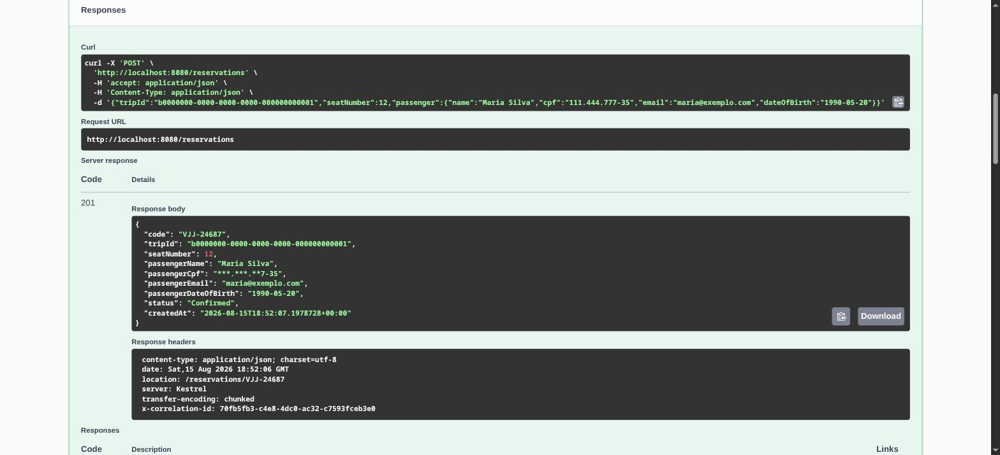

Consultar reserva pelo código — `200 OK`, CPF mascarado:

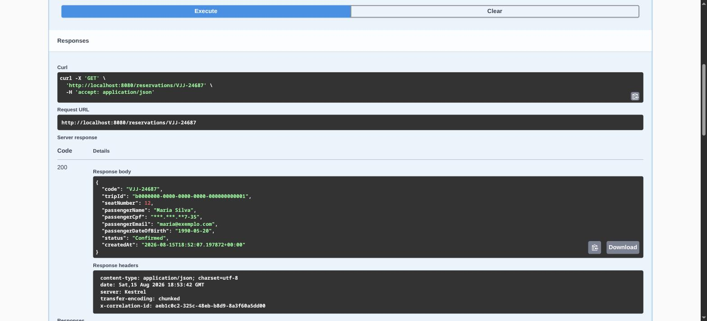

Cancelar reserva — `200 OK`, estado `Cancelled`:

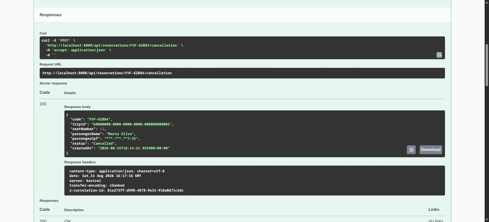

Buscar viagens por origem, destino e data — `200 OK`:

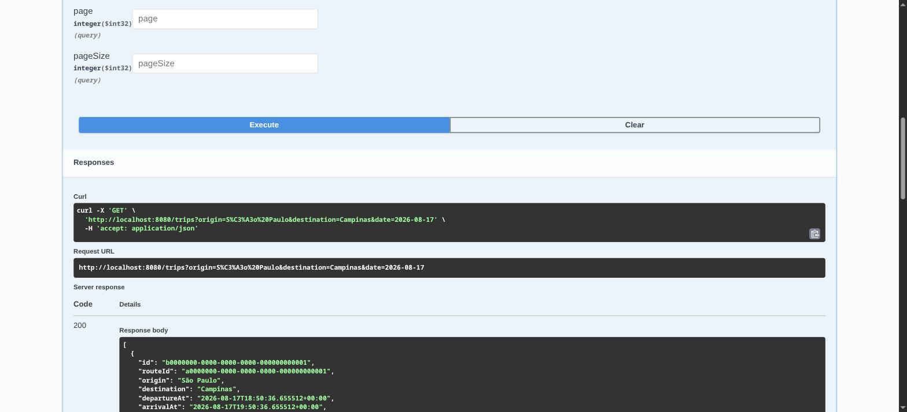

Detalhe da viagem com o mapa de assentos — `200 OK`:

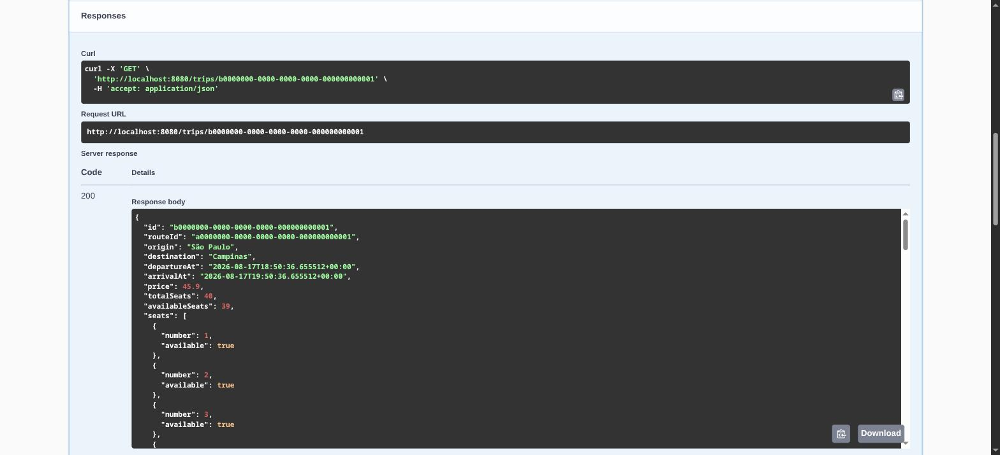

Listar rotas — `200 OK`:

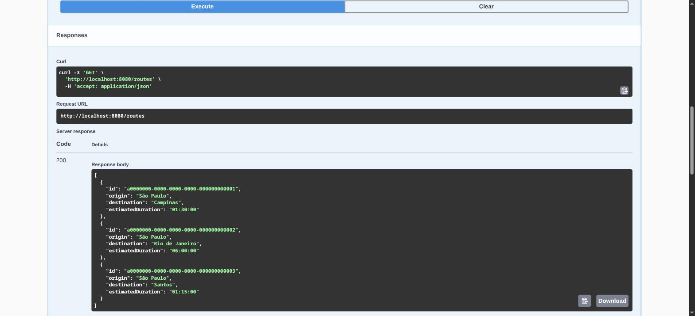

**Caminhos de erro**

CPF inválido — `400 Bad Request` (Problem Details com erro por campo):

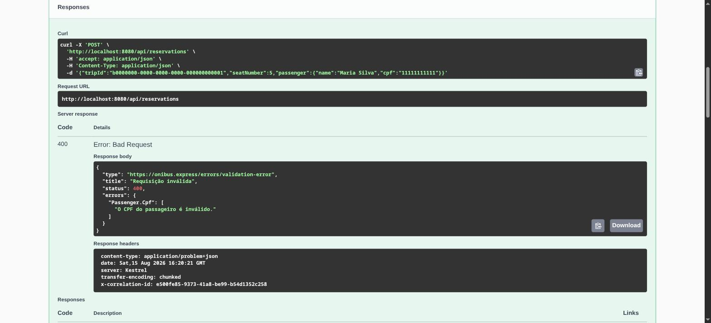

Viagem inexistente — `404 Not Found`:

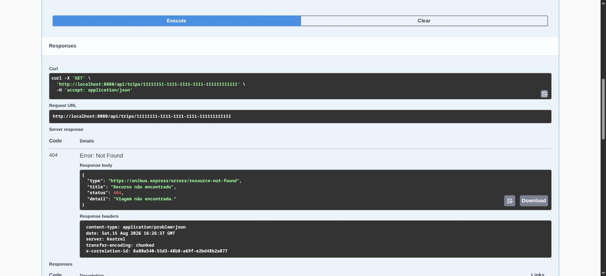

Assento já reservado — `409 Conflict` (prevenção de *double-booking*, RN-01):

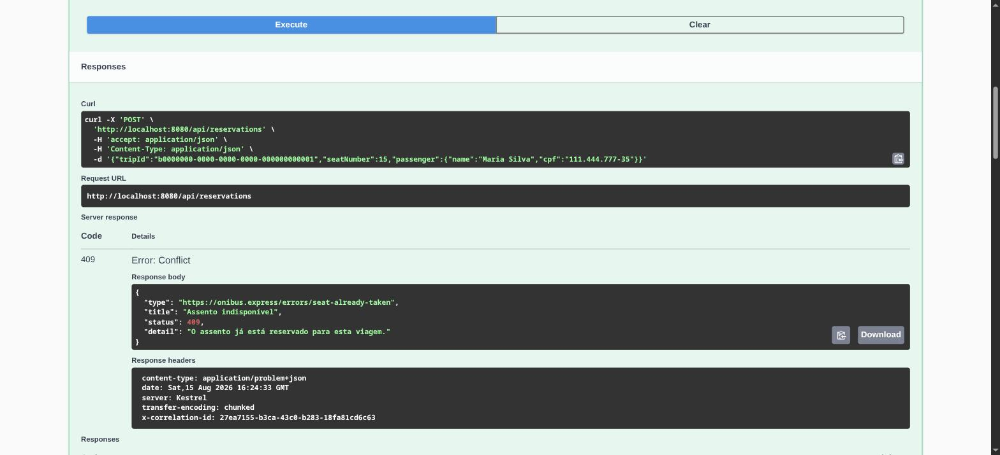

Reserva em viagem no passado — `422 Unprocessable Entity`:

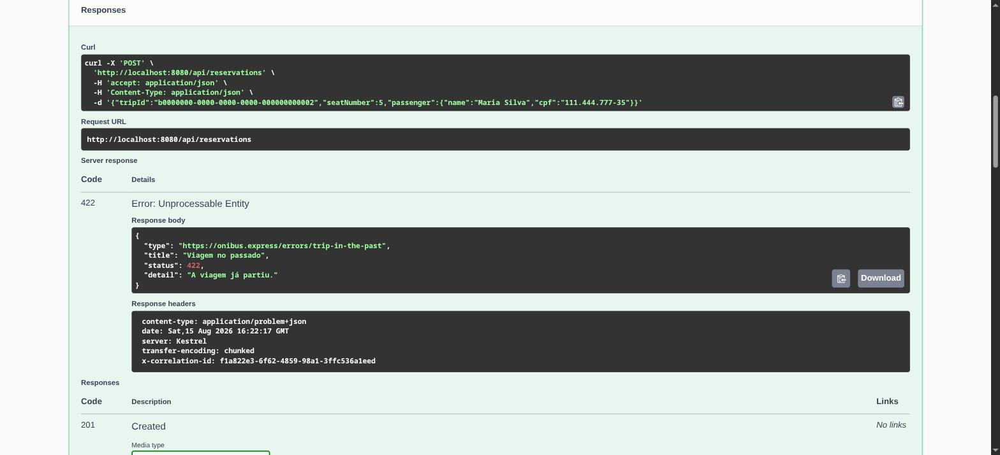

---

## Tecnologias e justificativa

| Tecnologia | Por quê |
|---|---|
| **.NET 8 (LTS)** | Versão de suporte estendido; base estável e de longa vida para a API. |
| **ASP.NET Core Minimal APIs** | Endpoints enxutos, baixo *overhead* e startup rápido para uma API focada. |
| **EF Core + Npgsql** | Mapeamento objeto-relacional maduro para PostgreSQL, com *migrations* versionadas. |
| **PostgreSQL 16** | Banco relacional robusto; o **índice único parcial** é a peça central da concorrência. |
| **FluentValidation** | Validação de entrada declarativa e testável, separada do domínio. |
| **Serilog** | Log estruturado com *id* de correlação por requisição. |
| **Swashbuckle (Swagger)** | Documentação executável dos endpoints (OpenAPI), operável pela UI. |
| **xUnit + Testcontainers** | Testes de integração contra um PostgreSQL **real**, não *in-memory*. |
| **coverlet + ReportGenerator** | Medição de cobertura de testes. |
| **NetArchTest** | Testes que garantem as fronteiras entre camadas. |

---

## Arquitetura e decisões

**Clean Architecture** em quatro camadas, com as dependências sempre apontando para dentro. O
**Domínio** é puro (sem dependência de framework, banco ou web).

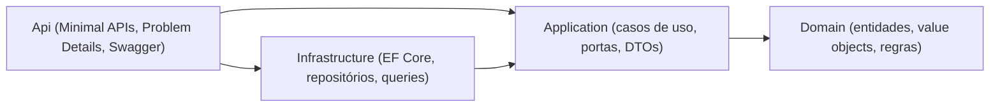

Princípios **SOLID** na prática: cada caso de uso tem uma responsabilidade única; a Application
depende de **abstrações** (portas) implementadas pela Infrastructure (inversão de dependência); os
*value objects* são fechados para modificação e válidos por construção.

Padrões de projeto empregados:

- **Value Object** (`Cpf`, `ReservationCode`, `PassengerName`): imutáveis, com igualdade por valor e
  validados na construção — estados inválidos são irrepresentáveis.
- **Result** para erros de negócio previsíveis, evitando exceções para controle de fluxo; traduzido
  para **Problem Details** na borda HTTP.
- **Repositório específico + Query services (CQRS-lite)**: escrita via repositórios de agregado;
  leitura via *queries* otimizadas (`AsNoTracking`, projeções) — sem repositório genérico.
- **TimeProvider** (relógio injetável do .NET 8) para tornar as regras temporais testáveis.

As decisões estão registradas em [**ADRs**](docs/adr/):

| ADR | Decisão |
|---|---|
| [0001](docs/adr/0001-arquitetura-em-camadas.md) | Arquitetura em camadas (Clean Architecture) |
| [0002](docs/adr/0002-framework-net8.md) | Framework-alvo .NET 8 (LTS) |
| [0003](docs/adr/0003-postgresql.md) | PostgreSQL como banco relacional |
| [0004](docs/adr/0004-sem-repositorio-generico.md) | Sem repositório genérico |
| [0005](docs/adr/0005-result-e-problem-details.md) | Erros via Result + Problem Details |
| [0006](docs/adr/0006-cancelamento-via-delete.md) | Cancelamento via `DELETE` (soft-cancel) |
| [0007](docs/adr/0007-codigo-de-reserva.md) | Geração do código de reserva |
| [0008](docs/adr/0008-concorrencia-indice-unico-parcial.md) | Double-booking via índice único parcial |
| [0009](docs/adr/0009-minimal-apis-em-modulos.md) | Minimal APIs organizadas em módulos |

O **system design** completo, a estimativa de capacidade e o plano de escala/custo estão no
[`docs/plan.md`](docs/plan.md); o contrato detalhado, as regras de negócio e a matriz de testes no
[`docs/spec.md`](docs/spec.md).

---

## Concorrência: o coração do sistema

Dois clientes podem tentar reservar **o mesmo assento na mesma viagem** ao mesmo tempo. A garantia de
que apenas um vence **não** é feita por uma checagem "consulta-depois-insere" em código (que abre uma
janela de corrida), e sim por uma **restrição no banco** — um índice único **parcial**:

```sql
CREATE UNIQUE INDEX ux_reservation_active_seat
    ON reservation (trip_id, seat_number)
    WHERE status = 'Confirmed';
```

Apenas reservas **confirmadas** entram no índice, então cancelar um assento o **libera** para uma
nova reserva. Uma violação de unicidade (`23505`) é traduzida em `409 Conflict`. Esse comportamento é
verificado por um teste de integração que dispara **N requisições paralelas** no mesmo assento e
exige exatamente **1 sucesso e N-1 conflitos** (ver ADR-0008).

---

## O que foi implementado (e o que ficou fora de escopo)

**Escopo:** backend. A interface de usuário está fora de escopo.

**Implementado:**

- Os 6 requisitos funcionais (RF-01 a RF-06) e as 9 regras de negócio (RN-01 a RN-09).
- Prevenção de double-booking garantida no banco, validada sob concorrência real.
- Geração de código de reserva legível (`ABC-12345`), com regeneração em caso de colisão.
- **Privacidade (LGPD):** CPF validado por módulo 11, armazenado normalizado, **mascarado** nas
  respostas e mantido fora dos logs.
- Problem Details (RFC 7807), validação de entrada, health checks, log estruturado com correlação e
  documentação Swagger.
- Paginação nas listagens (`page`/`pageSize`) e leituras sem *tracking* com projeções.
- Empacotamento com Docker (imagem multi-stage, usuário não-root) e execução com/sem contêiner.
- Suíte de testes: unitários, integração (Testcontainers), funcionais (ponta a ponta) e de
  arquitetura.

**Fora de escopo (decisão consciente):** interface de usuário; autenticação/autorização; pagamento;
verificação do CPF junto à Receita Federal; internacionalização. As premissas completas estão na
[`docs/spec.md`](docs/spec.md) (§2 e §12).

---

## Testes e cobertura

```bash
dotnet test
```

A pirâmide de testes:

- **Unitários** — domínio puro (CPF, código de reserva, janela de 2h, faixa de assentos, casos de uso).
- **Integração** — PostgreSQL real via **Testcontainers** (persistência, **concorrência**, consultas). Requer Docker.
- **Funcionais** — API de ponta a ponta com `WebApplicationFactory` + Testcontainers.
- **Arquitetura** — `NetArchTest` valida que o Domínio não depende de Infrastructure/Api.

Relatório de cobertura:

```bash
dotnet tool restore
dotnet test --collect:"XPlat Code Coverage" --settings coverlet.runsettings --results-directory ./coverage
dotnet tool run reportgenerator -reports:"coverage/**/coverage.cobertura.xml" -targetdir:coverage/report -reporttypes:Html
```

Cobertura de linha de **90,8%**, com o **Domínio em 97,7%** — as regras de negócio
(RN-01 a RN-08) estão amplamente cobertas.

---

## Estrutura do projeto

```
src/
  OniBusExpress.Domain/          Entidades, value objects, regras — sem dependências externas
  OniBusExpress.Application/     Casos de uso, portas (interfaces), DTOs
  OniBusExpress.Infrastructure/  EF Core, DbContext, migrations, repositórios, queries, seed
  OniBusExpress.Api/             Minimal APIs, Problem Details, Swagger, DI, observabilidade
tests/
  OniBusExpress.UnitTests/
  OniBusExpress.IntegrationTests/
  OniBusExpress.FunctionalTests/
  OniBusExpress.ArchitectureTests/
docs/                            spec, plan, constitution, ADRs
```

---

## Melhorias futuras

- Autenticação/autorização e limitação de taxa (*rate limiting*).
- Versionamento explícito da API e paginação por cursor (*keyset*) com metadados de total.
- Telemetria (métricas e *tracing* via OpenTelemetry).
- Publicação de imagem em *registry* e *deploy* automatizado a partir do CI.

---

## Documentação de referência

- [`docs/spec.md`](docs/spec.md) — contrato, regras de negócio, modelo de dados, matriz de testes.
- [`docs/plan.md`](docs/plan.md) — stack, system design, capacidade, escala e custo.
- [`docs/constitution.md`](docs/constitution.md) — princípios que guiam o projeto.
- [`docs/adr/`](docs/adr/) — registros de decisão de arquitetura.
