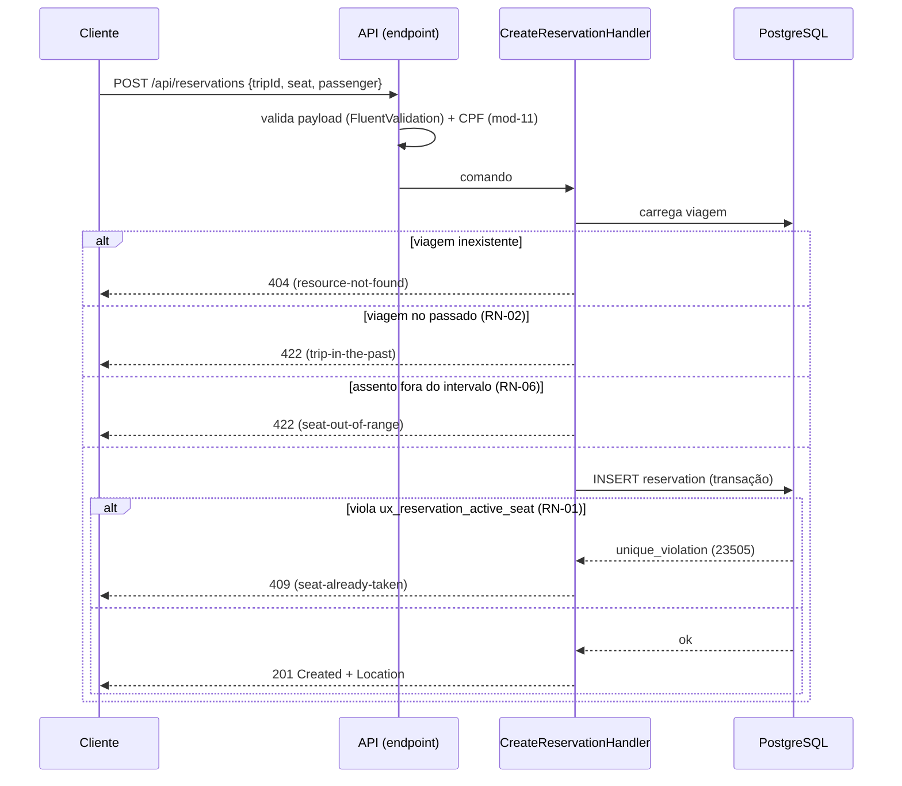
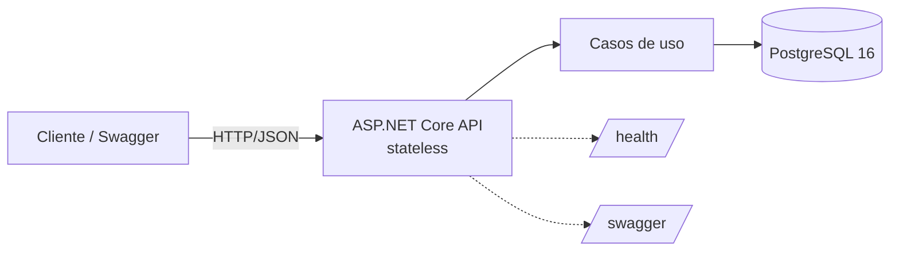
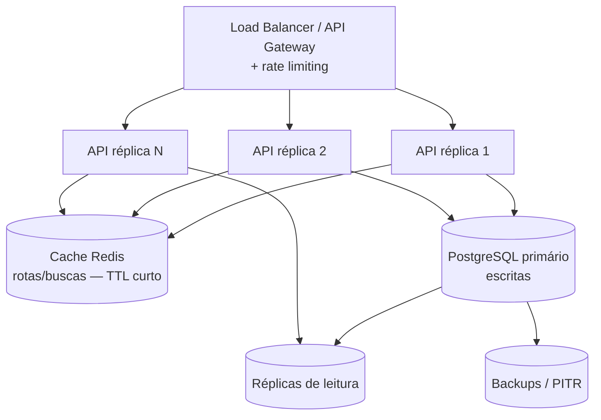

# Plano Técnico — OniBus Express

> O "como" do projeto. Traduz o `spec.md` em arquitetura, stack, padrões, modelo de dados,
> estratégia de testes, empacotamento e system design — sempre subordinado à `constitution.md`.
> Deriva o `tasks.md`. Versão 1.0.

---

## 1. Stack e justificativas

Cada tecnologia vem acompanhada da justificativa e da alternativa descartada.

| Tecnologia | Versão | Por que | Alternativa descartada e motivo |
|---|---|---|---|
| **.NET / ASP.NET Core** | `net8.0` (LTS) | Versão de suporte estendido (LTS), amplamente disponível em ambientes de produção. | `net10.0` — mais recente, sem ganho para este escopo e com menor disponibilidade nos ambientes-alvo. |
| **Minimal APIs** | — | Menos cerimônia que controllers para 6 endpoints; menor superfície, melhor performance de startup. | MVC Controllers — verboso demais para o tamanho do problema. |
| **Entity Framework Core + Npgsql** | 8.x | ORM maduro; `DbContext` já é *Unit of Work* + *Repository*; provider PostgreSQL de primeira linha. | Dapper — mais controle, mas mais boilerplate e sem migrations integradas. |
| **PostgreSQL** | 16 | Índice único **parcial** (essencial para a concorrência), robusto, gratuito, ótimo com Testcontainers. | SQL Server — bom no mundo .NET, mas imagem pesada e sem vantagem aqui. |
| **FluentValidation** | 11.x | Validação de entrada declarativa, testável e desacoplada do modelo. | Data Annotations — limitado para regras compostas (ex.: CPF). |
| **Swashbuckle (Swagger/OpenAPI)** | 6.x | Documentação executável da API; permite explorar e chamar os endpoints direto do navegador. | — |
| **xUnit** | 2.x | Padrão de facto no ecossistema .NET; ótimo com paralelismo. | NUnit — equivalente; xUnit por familiaridade e integração. |
| **Testcontainers for .NET** | 3.x | Sobe PostgreSQL real e descartável nos testes de integração — valida o comportamento real de concorrência. | SQLite nos testes — o dialeto diverge do PostgreSQL de produção em constraints e concorrência. |
| **Serilog** | 3.x | Logs estruturados com enriquecimento (correlation id); *sinks* flexíveis. | `ILogger` puro — sem estruturação rica pronta. |
| **coverlet + ReportGenerator** | — | Cobertura medida e publicada no CI. | — |
| **Respawn** | 6.x | Reset rápido do estado do banco entre testes de integração. | Recriar container por teste — lento. |

**Determinismo de build:** `global.json` fixa o SDK em `8.0.4xx` (`rollForward: latestFeature`),
garantindo build reproduzível mesmo com SDKs 9/10 presentes na máquina.

---

## 2. Estrutura da solução (Clean Architecture)

Dependências apontam sempre para dentro; o domínio não conhece EF nem HTTP.

```
onibus-express/
├─ src/
│  ├─ OniBusExpress.Domain/          # Entidades, value objects, regras puras, erros de domínio
│  │   ├─ Reservations/              #   Reservation, ReservationCode, ReservationStatus
│  │   ├─ Trips/                     #   Trip, Route
│  │   ├─ Passengers/                #   Cpf (value object com validação mod-11), PassengerName
│  │   └─ Abstractions/              #   Result<T>, DomainError
│  ├─ OniBusExpress.Application/     # Casos de uso, DTOs, validações, portas (interfaces)
│  │   ├─ Reservations/              #   CreateReservation, CancelReservation, GetReservation
│  │   ├─ Trips/                     #   ListRoutes, SearchTrips, GetTripDetails
│  │   └─ Abstractions/              #   IReservationRepository, IUnitOfWork, IClock (TimeProvider)
│  ├─ OniBusExpress.Infrastructure/  # EF Core, DbContext, migrations, seed, repositórios
│  │   ├─ Persistence/               #   AppDbContext, configurations, migrations
│  │   └─ Reservations/              #   ReservationRepository
│  └─ OniBusExpress.Api/             # Minimal APIs, ProblemDetails, Swagger, DI, middleware
│      ├─ Endpoints/                 #   RouteEndpoints, TripEndpoints, ReservationEndpoints
│      └─ Contracts/                 #   Request/Response DTOs (CPF mascarado na saída)
├─ tests/
│  ├─ OniBusExpress.UnitTests/       # Domínio puro (CPF, código, janela 2h, assento)
│  ├─ OniBusExpress.IntegrationTests/# Testcontainers + PostgreSQL real (concorrência, persistência)
│  ├─ OniBusExpress.FunctionalTests/ # WebApplicationFactory (6 endpoints ponta a ponta)
│  └─ OniBusExpress.ArchitectureTests/# NetArchTest (fronteiras de camada)
├─ docs/                             # constitution, spec, plan, tasks, adr/
├─ docker-compose.yml
├─ Dockerfile
├─ global.json
├─ .editorconfig
└─ README.md
```

**Regra de dependência:** `Api → Application → Domain`; `Infrastructure → Application/Domain`.
O `Domain` não referencia nenhum outro projeto. Um teste de arquitetura (NetArchTest) reprova o
build se essa regra for violada (T-23).

---

## 3. Padrões de design e o porquê de cada um

| Padrão | Onde | Por que |
|---|---|---|
| **Clean Architecture** | solução inteira | Isola regra de negócio de infraestrutura; testável sem banco nem HTTP. |
| **Value Object** | `Cpf`, `ReservationCode` | Encapsula validação e formato onde eles pertencem; um `Cpf` inválido não existe no domínio. |
| **Result pattern** | `Application` | Erros previsíveis (assento ocupado, viagem passada) não usam exceção para controle de fluxo (constituição P5). |
| **Repository (estreito, por agregado)** | `IReservationRepository` | Só onde revela intenção/ajuda teste; **sem** repositório genérico — o `DbContext` já é UoW+Repo (ADR-0004). |
| **Unit of Work** | `DbContext`/`SaveChanges` | Transação atômica na criação da reserva. |
| **Options pattern** | configuração | Configuração tipada e validada no startup. |
| **Factory / retry** | geração de `ReservationCode` | Gera código legível e re-tenta em colisão sob o índice único (ADR-0007). |
| **Mediator (leve, manual)** | endpoints → casos de uso | Endpoints finos delegam a *handlers*; sem acoplar HTTP à regra. (MediatR evitado por licença comercial recente e por ser desnecessário no tamanho do MVP.) |
| **Guard clause** | validação de entrada | Falha cedo, mantém o caminho feliz linear. |

---

## 4. Modelo de dados, migrations e seed

- Modelo e ER: ver `spec.md` §3 e §9. Chaves `uuid`, datas `timestamptz` (UTC), preço `numeric(10,2)`.
- **Restrição de concorrência (o coração do sistema):**

```sql
CREATE UNIQUE INDEX ux_reservation_active_seat
    ON reservation (trip_id, seat_number)
    WHERE status = 'Confirmed';
```

- **Migrations:** versionadas no `Infrastructure`. Aplicadas automaticamente no startup em ambiente
  de contêiner (com *retry* de conexão), e via `dotnet ef database update` no modo sem Docker.
- **Seed (obrigatório para operar via Swagger):** popula rotas reais de exemplo (SP→Campinas,
  SP→Rio, SP→Santos…) e viagens cobrindo os três casos de teste manuais:
  1. viagem **futura** (permite reservar);
  2. viagem **passada** (prova a RN-02);
  3. viagem **partindo em <2h** (prova a janela da RN-05).

---

## 5. Fluxo crítico — criar reserva sob concorrência



A vitória de exatamente uma requisição sob N chamadas paralelas é garantida pelo banco e
verificada pelo teste T-15. A tradução de `PostgresException 23505` → `409` fica isolada no
`Infrastructure`; o domínio permanece puro.

---

## 6. Erros, validação e privacidade

- **Erros:** `Result` na aplicação → `ProblemDetails` (RFC 7807) na borda, via `IExceptionHandler`
  e um mapeador de `DomainError → status`. Catálogo em `spec.md` §8.
- **Validação:** FluentValidation nos DTOs de entrada (formato de CPF, `seatNumber > 0`, `tripId`
  GUID, nome não vazio). Regras de negócio ficam no domínio, não no validador.
- **Privacidade (LGPD, RNF-11):** o `Cpf` é armazenado só com dígitos; um `ITypeConverter`/DTO de
  saída o retorna mascarado (`***.***.**9-00`); um *enricher* do Serilog impede CPF em log. Segredos
  ficam em variáveis de ambiente (`.env.example` versionado, `.env` ignorado).

---

## 7. Observabilidade
- `/health` (liveness) e `/health/ready` (readiness, testando o banco via health check do Npgsql).
- Serilog com saída estruturada e `traceId` por requisição (propagado no `ProblemDetails`).

---

## 8. Estratégia de testes

Pirâmide, do rápido/barato ao lento/caro (constituição P2):

| Nível | Projeto | O que cobre | Infra |
|---|---|---|---|
| Unitário | `UnitTests` | CPF (T-01..05), código (T-06/07), assento (T-08), viagem passada (T-09), janela 2h (T-10..12) | nenhuma |
| Integração | `IntegrationTests` | persistência, reserva (T-13/14), **concorrência (T-15)**, liberação no cancelamento (T-16/17) | Testcontainers + PostgreSQL |
| Funcional | `FunctionalTests` | 6 endpoints ponta a ponta, ProblemDetails, `Location` (T-18..22) | WebApplicationFactory (+ Testcontainers) |
| Arquitetura | `ArchitectureTests` | fronteiras de camada (T-23) | NetArchTest |

**Relógio nos testes:** `TimeProvider` falso (`FakeTimeProvider`) torna T-09..12 determinísticos.
**Cobertura:** coverlet no CI, relatório via ReportGenerator, foco em RN-01..08 (não perseguir 100%).
**CI (GitHub Actions):** *restore → build → test (com Docker para Testcontainers) → cobertura* a
cada push, mantendo a suíte sempre verde.

**Onde os testes rodam:** a suíte é executada por `dotnet test`, não pelo `docker-compose`. O
`docker-compose` serve para **operar a aplicação**; os testes de integração/funcionais sobem seu
**próprio** PostgreSQL descartável via Testcontainers, que conversa com o daemon Docker da máquina
ou do runner de CI (os runners do GitHub Actions já vêm com Docker). Os testes unitários não
precisam de Docker.

---

## 9. Empacotamento e execução

- **Dockerfile** multi-stage (`sdk` → build/test → `aspnet` runtime), usuário **não-root**,
  `.dockerignore` enxuto.
- **docker-compose:** serviços `api` + `postgres`; o Postgres tem `healthcheck` e a API usa
  `depends_on: condition: service_healthy` — **evita o crash de subir antes do banco**.
- **Config por ambiente:** connection string via variável (`ConnectionStrings__Default`); host
  `postgres` no compose, `localhost` sem Docker. Documentado no README nas duas formas.
- **Sem Docker:** `dotnet ef database update` + `dotnet run`, apontando para um PostgreSQL local.

---

## 10. System design

### 10.1 Visão específica da aplicação (o que entrego)



A API é **stateless** — nenhum estado de sessão em memória — o que a torna escalável
horizontalmente por réplicas atrás de um balanceador. O único estado é o PostgreSQL, que também é
a fronteira de consistência (índice único).

### 10.2 Visão geral de produção (para onde escala)



Leituras (listar rotas, buscar viagens) dominam o tráfego e são **cacheáveis** com TTL curto;
escritas (reservas) vão ao primário, onde a integridade é garantida. Réplicas de leitura absorvem
a busca. Esse desenho só é ativado conforme a carga justificar (evolução, não MVP).

---

## 11. Estimativa de capacidade (ancorada em dados de São Paulo)

Na ausência de um número de carga fornecido, eu a **estimo a partir de dados reais** de mercado e
desenho para ela.

**Fontes:** Rodoviária do Tietê — ~90 mil passageiros/dia e **>60 mil passagens vendidas/dia**;
ClickBus (maior marketplace do país) — +62 mi de passagens acumuladas, run-rate recente na ordem
de ~15–20 mi/ano.

**Premissas (explícitas):**
- Escala de referência = um operador/terminal grande: **60.000 reservas/dia** (escritas).
- Janela operacional efetiva ≈ 18h; pico horário concentra ~12% do dia.
- Razão *look-to-book* (buscas:compras) conservadora de **30:1** — viajante navega muito antes de comprar.

**Derivação:**

| Métrica | Média | Pico horário | Pico sazonal (feriado, projeto p/ isso) |
|---|---|---|---|
| Reservas (escrita) | ~0,9/s | ~2/s | ~10–50/s |
| Leituras (busca/detalhe) | ~28/s | ~60/s | ~300–500/s |
| **Total** | **~1.700 req/min** | **~3.700 req/min** | **~30.000 req/min (~500 req/s)** |

**Metas não-funcionais assumidas (NFR):**
- Sustentar **500 req/s (~30k req/min)** com **p95 < 200 ms** nas leituras e **< 300 ms** na
  reserva, mantendo a garantia de não-duplicidade sob rajada de dezenas de escritas/s.
- A API escala horizontalmente; o gargalo é o PostgreSQL, mitigado por cache de leitura e réplicas.
- **Rate limiting** nos endpoints de escrita (token bucket por IP) protege contra rajada/abuso e
  materializa esse limite em código.

---

## 12. Apêndice (visão de evolução — além do escopo do MVP)

> Marcado explicitamente como forward-looking. Não infla o núcleo; registra a visão de custo e escala.

### 12.1 Plano de escala por estágio

| Estágio | Carga | Ação |
|---|---|---|
| MVP | até ~100 req/s | 1–2 réplicas da API + 1 PostgreSQL. |
| Crescimento | ~100–500 req/s | Autoscaling de réplicas; cache Redis nas buscas; réplica de leitura. |
| Pico sazonal | >500 req/s | Escala horizontal agressiva (HPA), *connection pooling* (PgBouncer), fila para picos de escrita se necessário. |

### 12.2 Custo mensal ilustrativo (ordem de grandeza, região Brasil, pay-as-you-go)

> Cada valor é o custo **mensal, em dólares (US$/mês)**, para manter a infraestrutura no ar no tier
> base — não é por requisição nem por registro. São valores aproximados para comparação relativa;
> variam por região, reserva de capacidade e câmbio.

| Camada | **Azure** (principal) | AWS | GCP |
|---|---|---|---|
| Compute (API, ~2 vCPU) | Container Apps / App Service P1v3 — ~US$ 120–170 | ECS Fargate (2 tasks) — ~US$ 90–140 | Cloud Run — ~US$ 80–130 |
| PostgreSQL gerenciado | Flexible Server GP pequeno — ~US$ 130–180 | RDS db.t3.medium — ~US$ 90–130 | Cloud SQL pequeno — ~US$ 90–140 |
| Balanceador / Gateway | App Gateway — ~US$ 25 | ALB — ~US$ 20 | HTTPS LB — ~US$ 20 |
| **Total base MVP** | **~US$ 275–375/mês** | **~US$ 200–290/mês** | **~US$ 190–290/mês** |

Custo por requisição na faixa de pico (~30k req/min ≈ ~1,3 bi req/mês) fica na ordem de
**frações de centavo de dólar por requisição** no tier base — dominado pelo banco, não pelo compute,
o que reforça o cache de leitura como principal alavanca de custo.

---

*ADRs referenciados (ADR-0001..0007) são registrados em `docs/adr/` no próximo commit.*
