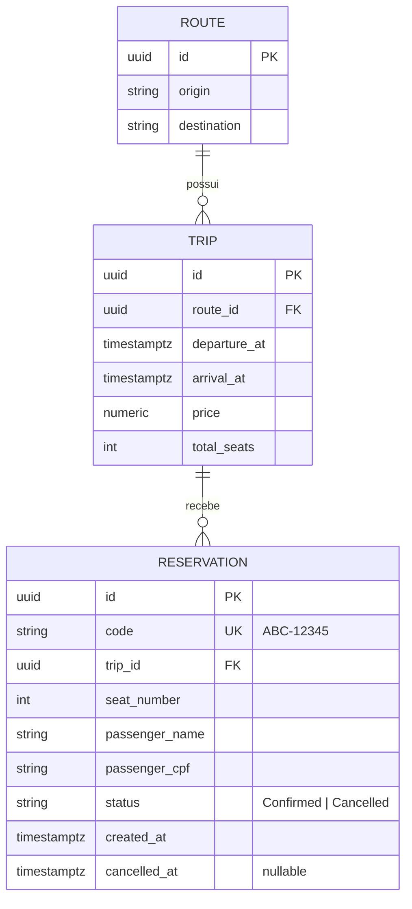

# Especificação Técnica — OniBus Express

> Documento de especificação (Spec-Driven Development). É a fonte da verdade da qual derivo o
> system design, os ADRs, o modelo de dados, o contrato da API e a matriz de casos de teste.
> Versão 1.0 — base do desenvolvimento orientado a testes (TDD).

---

## 1. Contexto e objetivo

O OniBus Express é o MVP de um sistema de bilhetagem para venda de passagens de ônibus
intermunicipais/interestaduais. Este documento especifica **apenas o backend** — uma API HTTP
(ASP.NET Core Web API) responsável por expor rotas, viagens e por gerenciar o ciclo de vida de
uma reserva de assento, garantindo consistência sob concorrência.

O objetivo do MVP é permitir que um consumidor:

1. descubra as rotas disponíveis;
2. busque viagens de uma rota em uma data;
3. veja os detalhes e a disponibilidade de assentos de uma viagem;
4. reserve um assento informando os dados do passageiro;
5. consulte a reserva pelo código;
6. cancele a reserva dentro da janela permitida.

Priorizo a correção das regras de negócio, a consistência de dados sob concorrência, testes
significativos e a portabilidade (com e sem Docker) como pilares deste MVP.

---

## 2. Escopo

### 2.1 Dentro do escopo
- API REST com os seis endpoints essenciais (seção 7).
- Regras de negócio da seção 5, com destaque para a prevenção de reserva dupla (double-booking).
- Persistência relacional (PostgreSQL) via EF Core, com migrations versionadas.
- Validação de CPF (dígitos verificadores por módulo 11).
- Geração de código de reserva único, legível, no formato `ABC-12345`.
- Documentação executável via Swagger/OpenAPI.
- Testes automatizados: unitários, de integração (PostgreSQL real), funcionais (HTTP) e de arquitetura.
- Empacotamento com Docker + docker-compose e execução alternativa sem Docker.
- Observabilidade mínima (health checks, logs estruturados, correlação de requisição).

### 2.2 Fora do escopo
- Front-end (interface de usuário) — fora do escopo desta entrega, centrada no backend.
- Autenticação/autorização de usuários e perfis administrativos.
- Pagamento e emissão fiscal.
- Verificação de existência real do CPF junto à Receita Federal (exigiria serviço externo; a
  validação implementada é a checagem matemática dos dígitos verificadores, que é o critério
  offline completo de validade de CPF).
- Assentos com atributos comerciais (leito, semileito, poltrona premium) além da numeração.

---

## 3. Glossário e modelo de domínio

| Termo | Definição |
|---|---|
| **Rota** (`Route`) | Par origem→destino operado pela empresa (ex.: São Paulo → Campinas). |
| **Viagem** (`Trip`) | Uma partida programada de uma rota, com data/hora, preço e um total de assentos. |
| **Assento** (`Seat`) | Posição numerada (1..N) dentro de uma viagem. A ocupação é derivada das reservas confirmadas. |
| **Reserva** (`Reservation`) | Vínculo entre um passageiro e um assento de uma viagem, identificado por um código. |
| **Passageiro** (`Passenger`) | Dados do titular da reserva (nome + CPF). Modelado como *value object* embutido na reserva. |
| **Código de reserva** | Identificador público, único e legível da reserva, no formato `ABC-12345`. |

### 3.1 Diagrama de entidades



> **Nota de modelagem:** não persisto uma tabela de assentos. Os assentos de uma viagem são o
> intervalo `1..total_seats`; a ocupação é a projeção das reservas com `status = Confirmed`. Isso
> reduz alocação e escrita desnecessárias (ver RNF de eficiência) e simplifica a liberação do
> assento no cancelamento.

---

## 4. Requisitos funcionais

| ID | Requisito |
|---|---|
| **RF-01** | Listar as rotas disponíveis. |
| **RF-02** | Buscar viagens por origem, destino e data. |
| **RF-03** | Obter os detalhes de uma viagem, incluindo o mapa de disponibilidade dos assentos. |
| **RF-04** | Criar uma reserva para um assento de uma viagem, informando os dados do passageiro. |
| **RF-05** | Recuperar uma reserva pelo seu código. |
| **RF-06** | Cancelar uma reserva pelo seu código. |

---

## 5. Regras de negócio

| ID | Regra | Efeito em erro |
|---|---|---|
| **RN-01** | Um assento já reservado (reserva `Confirmed`) **não** pode ser reservado novamente. Deve permanecer consistente sob requisições concorrentes. | `409 Conflict` |
| **RN-02** | Não é possível reservar uma viagem cuja partida já ocorreu (`departure_at <= agora`). | `422 Unprocessable Entity` |
| **RN-03** | O CPF do passageiro deve ser válido: 11 dígitos, dígitos verificadores corretos por módulo 11 e não pode ser uma sequência de dígitos repetidos. | `400 Bad Request` |
| **RN-04** | O código de reserva é único e segue o formato `ABC-12345` (3 letras, hífen, 5 dígitos). O alfabeto de letras exclui `I` e `O` para legibilidade. | `500` só se esgotar as tentativas de geração (extremamente improvável) |
| **RN-05** | O cancelamento só é permitido até **2 horas antes** da partida (`agora <= departure_at - 2h`). | `422 Unprocessable Entity` |
| **RN-06** | O número do assento deve existir na viagem (`1 <= seat_number <= total_seats`). | `422 Unprocessable Entity` |
| **RN-07** | Cancelar uma reserva **libera** o assento, que volta a ficar disponível para nova reserva. | — |
| **RN-08** | Uma reserva já cancelada não pode ser cancelada de novo (operação não idempotente de negócio). | `409 Conflict` |
| **RN-09** | O nome do passageiro é obrigatório e não vazio (após *trim*). | `400 Bad Request` |

---

## 6. Requisitos não-funcionais

| ID | Requisito |
|---|---|
| **RNF-01 — Consistência sob concorrência** | O sistema deve impedir duas reservas confirmadas para o mesmo `(viagem, assento)` mesmo sob requisições simultâneas. A garantia é feita no banco (índice único filtrado) e não apenas em código de aplicação (ver seção 10). |
| **RNF-02 — Determinismo temporal** | Todas as regras dependentes de tempo (RN-02, RN-05) usam uma abstração de relógio injetável (`TimeProvider`), permitindo testes determinísticos e evitando `DateTime.Now` disperso. |
| **RNF-03 — Fuso horário** | Datas são armazenadas e comparadas em UTC (`timestamptz`). A borda de apresentação assume `America/Sao_Paulo`; decisões de conversão são explícitas, nunca implícitas. |
| **RNF-04 — Eficiência / green code** | O código evita alocações desnecessárias no caminho quente (sem LINQ supérfluo em laços quentes, uso de `Span`/`StringBuilder` onde relevante), usa I/O assíncrona ponta a ponta, *pooling* de conexões do Npgsql, leitura sem *tracking* (`AsNoTracking`) e projeções para evitar N+1, paginação nas listagens e *Server GC* no contêiner. |
| **RNF-05 — Padronização de erros** | Todas as respostas de erro seguem o formato *Problem Details* (RFC 7807), com `type`, `title`, `status`, `detail` e `traceId`. |
| **RNF-06 — Observabilidade** | Health check (`/health`), logs estruturados e um identificador de correlação por requisição. |
| **RNF-07 — Capacidade e escala** | O sistema é dimensionado para um pico estimado a partir de dados reais do mercado de passagens de São Paulo. A meta de vazão, a latência-alvo (p95) e o plano de escala horizontal são detalhados no documento de *system design*; a API é *stateless* para escalar horizontalmente. |
| **RNF-08 — Portabilidade** | O projeto executa de duas formas: (a) `docker compose up` sobe API + PostgreSQL; (b) sem Docker, via `dotnet run` apontando para um PostgreSQL local. Não uso banco *in-memory*. |
| **RNF-09 — Documentação executável** | Todos os endpoints são documentados via OpenAPI e chamáveis pelo Swagger UI, com descrições, parâmetros, exemplos e códigos de resposta. |
| **RNF-10 — Testabilidade** | A cobertura contempla, no mínimo, as regras RN-01 a RN-08, com relatório de cobertura gerado no CI. |
| **RNF-11 — Privacidade / LGPD** | O CPF é dado pessoal (Lei 13.709/2018). É armazenado normalizado (só dígitos), **nunca registrado em log em texto puro** e retornado **mascarado** nas respostas da API (ex.: `***.***.**9-00`, expondo apenas os dígitos finais). A validação usa o valor completo internamente; a exposição é sempre mascarada. |

---

## 7. Contrato da API

Prefixo base: `/api`. Formato: JSON. Datas em ISO-8601 UTC.

### RF-01 · `GET /api/routes`
Lista as rotas. Parâmetros opcionais de filtro: `origin`, `destination`.

- **200 OK** — array de rotas (`id`, `origin`, `destination`). Lista vazia continua sendo `200`.

### RF-02 · `GET /api/trips`
Busca viagens. Parâmetros: `origin` (obrigatório), `destination` (obrigatório), `date` (obrigatório, `YYYY-MM-DD`).

- **200 OK** — array de viagens (`id`, `origin`, `destination`, `departureAt`, `arrivalAt`, `price`, `availableSeats`). Lista vazia é `200`.
- **400 Bad Request** — parâmetros ausentes ou malformados.

### RF-03 · `GET /api/trips/{id}`
Detalhe de uma viagem com o mapa de assentos.

- **200 OK** — dados da viagem + lista de assentos com estado (`number`, `available`).
- **404 Not Found** — viagem inexistente.

### RF-04 · `POST /api/reservations`
Cria uma reserva.

Corpo: `{ "tripId": "...", "seatNumber": 12, "passenger": { "name": "...", "cpf": "..." } }`

- **201 Created** — reserva criada; retorna o recurso e o header `Location: /api/reservations/{code}`.
- **400 Bad Request** — payload inválido, CPF inválido (RN-03), nome vazio (RN-09).
- **404 Not Found** — viagem inexistente.
- **409 Conflict** — assento já ocupado (RN-01).
- **422 Unprocessable Entity** — viagem no passado (RN-02) ou assento fora do intervalo (RN-06).

### RF-05 · `GET /api/reservations/{code}`
Recupera a reserva pelo código.

- **200 OK** — dados da reserva, com o **CPF mascarado** (RNF-11).
- **404 Not Found** — código inexistente.

### RF-06 · `POST /api/reservations/{code}/cancellation`
Cancela a reserva. Modelado como criação de um recurso de *cancelamento* sob a reserva, e não
como `DELETE`, porque o cancelamento é uma **transição de estado**: a reserva não é removida,
passa a `Cancelled` e continua consultável (decisão registrada em ADR-0006).

- **200 OK** — cancelada com sucesso; retorna a reserva no estado `Cancelled` (RN-07).
- **404 Not Found** — código inexistente.
- **409 Conflict** — reserva já cancelada (RN-08).
- **422 Unprocessable Entity** — fora da janela de 2 horas (RN-05).

---

## 8. Catálogo de erros (Problem Details — RFC 7807)

| `type` (sufixo) | HTTP | Origem |
|---|---|---|
| `validation-error` | 400 | payload/CPF/nome inválidos |
| `resource-not-found` | 404 | rota/viagem/reserva inexistente |
| `seat-already-taken` | 409 | RN-01 |
| `reservation-already-cancelled` | 409 | RN-08 |
| `trip-in-the-past` | 422 | RN-02 |
| `seat-out-of-range` | 422 | RN-06 |
| `cancellation-window-closed` | 422 | RN-05 |

Exemplo de corpo:

```json
{
  "type": "https://onibus.express/errors/seat-already-taken",
  "title": "Assento indisponível",
  "status": 409,
  "detail": "O assento 12 da viagem já está reservado.",
  "traceId": "00-2f9c...-01"
}
```

---

## 9. Modelo de dados e restrições

- Chaves primárias: `uuid`.
- Datas: `timestamptz` (UTC).
- Preço: `numeric(10,2)`.
- **Restrição-chave (RNF-01):** índice único **filtrado** garantindo no máximo uma reserva
  confirmada por assento/viagem, permitindo re-reserva após cancelamento:

```sql
CREATE UNIQUE INDEX ux_reservation_active_seat
    ON reservation (trip_id, seat_number)
    WHERE status = 'Confirmed';
```

- Índice único em `reservation.code` para unicidade do código público (RN-04).
- Índice em `trip (route_id, departure_at)` para a busca de viagens (RF-02).

---

## 10. Estratégia de concorrência (prevenção de double-booking)

A regra RN-01 é o ponto crítico do sistema. Uma checagem "consulta-depois-insere" em código é
insuficiente: duas requisições simultâneas podem ler o assento como livre e ambas inserir.

**Decisão:** a fonte da verdade é o banco. O índice único filtrado da seção 9 torna
fisicamente impossível haver duas reservas `Confirmed` no mesmo assento/viagem. O fluxo de criação:

1. valida entrada e regras de negócio (RN-02, RN-03, RN-06, RN-09);
2. tenta inserir a reserva dentro de uma transação;
3. se o banco recusar por violação do índice único, traduzo a exceção de persistência em
   `409 Conflict` (`seat-already-taken`).

Essa abordagem é correta sob qualquer nível de concorrência e é validada por um teste de
integração que dispara múltiplas requisições paralelas contra o mesmo assento em um PostgreSQL
real (Testcontainers), exigindo que exatamente uma vença e as demais recebam `409`.

---

## 11. Matriz de casos de teste (derivada da spec)

Enumero os casos aqui, antes de codar, para não esquecer nenhum. Cada caso é implementado no
ciclo TDD (red → green → refactor). Nível: **U**nitário, **I**ntegração, **F**uncional.

| # | Caso | Regra | Nível | Esperado |
|---|---|---|---|---|
| T-01 | CPF válido é aceito | RN-03 | U | válido |
| T-02 | CPF com um dígito trocado é rejeitado | RN-03 | U | inválido |
| T-03 | CPF com dígitos repetidos (ex.: `111...`) é rejeitado | RN-03 | U | inválido |
| T-04 | CPF com formatação (pontos/traço) é normalizado e validado | RN-03 | U | válido |
| T-05 | CPF com tamanho ≠ 11 é rejeitado | RN-03 | U | inválido |
| T-06 | Código gerado casa o formato `ABC-12345` e evita letras ambíguas | RN-04 | U | formato válido |
| T-07 | Geração de código lida com colisão (regenera) | RN-04 | U/I | código único |
| T-08 | Assento fora de `1..total_seats` é rejeitado | RN-06 | U | 422 |
| T-09 | Reserva em viagem no passado é rejeitada (relógio fixo) | RN-02 | U | 422 |
| T-10 | Cancelamento a mais de 2h da partida é permitido | RN-05 | U | ok |
| T-11 | Cancelamento a menos de 2h da partida é negado | RN-05 | U | 422 |
| T-12 | Cancelamento exatamente no limite de 2h (borda) | RN-05 | U | ok |
| T-13 | Reservar assento livre cria reserva confirmada | RF-04 | I | 201 |
| T-14 | Reservar assento já confirmado retorna conflito | RN-01 | I | 409 |
| T-15 | **Concorrência:** N requisições paralelas no mesmo assento → 1 vence, resto 409 | RN-01/RNF-01 | I | 1×201, (N-1)×409 |
| T-16 | Cancelar reserva libera o assento para nova reserva | RN-07 | I | reserva subsequente 201 |
| T-17 | Cancelar reserva já cancelada retorna conflito | RN-08 | I/F | 409 |
| T-18 | `GET /trips` sem resultados retorna 200 com lista vazia | RF-02 | F | 200 |
| T-19 | `GET /trips/{id}` inexistente retorna 404 | RF-03 | F | 404 |
| T-20 | `GET /reservations/{code}` inexistente retorna 404 | RF-05 | F | 404 |
| T-21 | `POST /reservations` com CPF inválido retorna 400 ProblemDetails | RN-03 | F | 400 |
| T-22 | `POST /reservations` bem-sucedido retorna 201 + header `Location` | RF-04 | F | 201 |
| T-23 | Testes de arquitetura: Domain não depende de Infrastructure/Api | RNF | A | ok |

---

## 12. Premissas e decisões

- **Framework-alvo:** `net8.0` (LTS), pela estabilidade de suporte estendido e ampla
  disponibilidade nos ambientes de produção. (ADR-0002)
- **Banco:** PostgreSQL único, sem provider *in-memory*. (ADR-0003)
- **Arquitetura:** Clean Architecture enxuta (Domain / Application / Infrastructure / Api),
  sem repositório genérico por reflexo — o `DbContext` já é *Unit of Work* + *Repository*.
  (ADR-0004)
- **Erros de domínio** trafegam como *Result* na aplicação e são traduzidos para *Problem Details*
  na borda HTTP. (ADR-0005)
- **Cancelamento** via `POST /reservations/{code}/cancellation` (transição de estado, não `DELETE`).
  (ADR-0006)
- **Uma reserva reserva exatamente um assento** para um passageiro. Compra de múltiplos assentos
  num único pedido está fora do escopo do MVP.
- **Seed de dados:** o banco é populado com rotas e viagens de exemplo (incluindo viagem futura,
  viagem passada e viagem dentro da janela de 2h) para permitir a operação imediata da API via
  Swagger. Detalhado no `plan.md`.

As decisões acima e suas alternativas ficam registradas como ADRs em `docs/adr/`. O documento de
*system design* (geral e específico da aplicação), a estimativa de carga baseada no mercado de São
Paulo, a análise de custo em nuvem e o plano de escala são tratados em `docs/system-design.md`.
